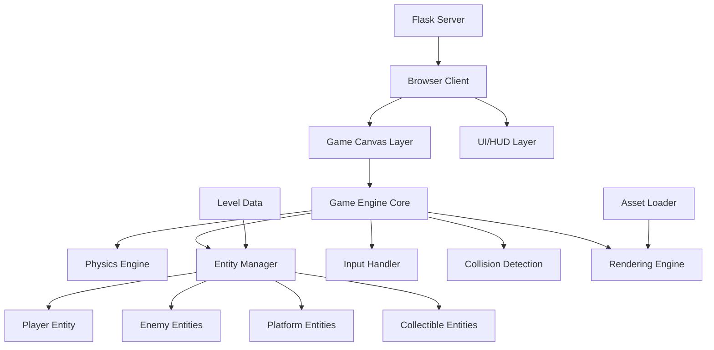
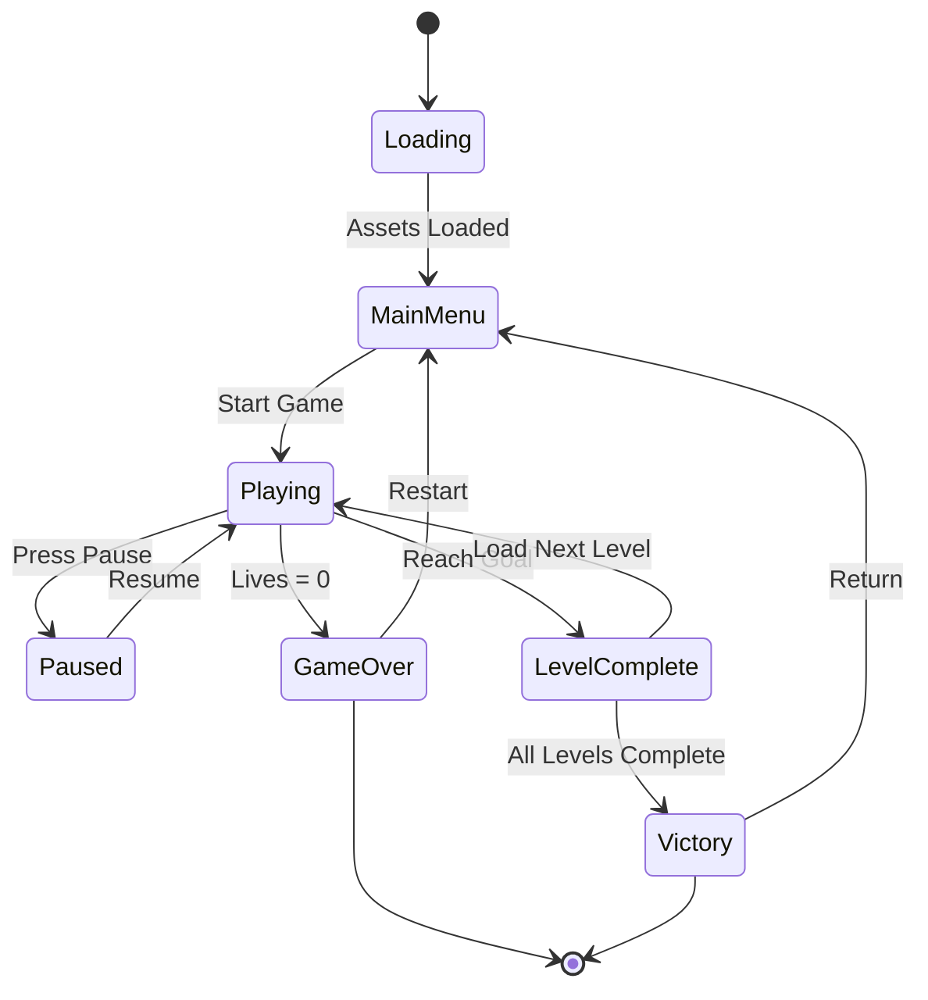
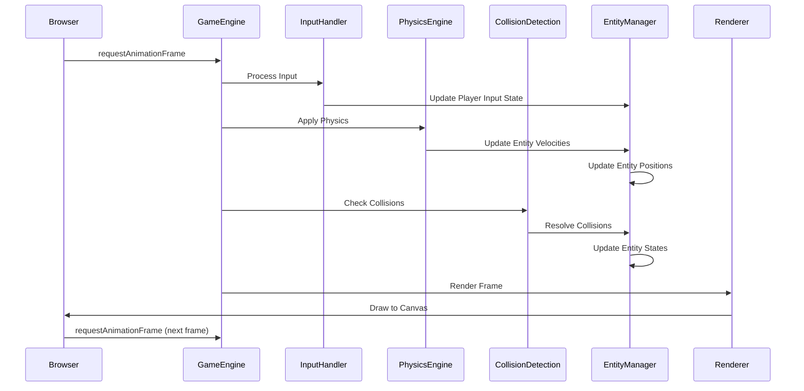

# Platformer Game Development - Super Mario Bros Style

## Overview

A classic 2D platformer game inspired by Super Mario Bros for the Nintendo Entertainment System. This will be a minimal demo featuring 1-2 levels that showcase core platforming mechanics including running, jumping, enemy interaction, and basic level progression.

## Objectives

- Create an engaging retro-style platformer experience reminiscent of classic Super Mario Bros
- Implement smooth character movement and physics-based jumping mechanics
- Design interactive levels with platforms, obstacles, and enemies
- Provide a web-based gaming experience that runs directly in the browser
- Establish a foundation that can be expanded with additional levels and features in the future

## Technology Stack

- **Frontend Framework**: HTML5 Canvas for game rendering
- **Game Logic**: Vanilla JavaScript (ES6+)
- **Server**: Flask (Python) for serving static game assets
- **Styling**: CSS for UI elements outside the game canvas
- **Asset Loading**: JavaScript-based resource management

## Architecture Design

### System Components



### Module Structure

| Module | Responsibility |
|--------|---------------|
| Game Engine Core | Main game loop, state management, frame updates |
| Physics Engine | Gravity simulation, velocity calculations, jump mechanics |
| Entity Manager | Creation, update, and lifecycle management of game objects |
| Input Handler | Keyboard event capture and player control mapping |
| Collision Detection | Spatial queries, bounding box checks, collision response |
| Rendering Engine | Canvas drawing operations, sprite rendering, camera system |
| Level Manager | Level data loading, tile map parsing, level progression |
| Asset Loader | Image preloading, resource caching, loading screen |
| Audio Manager | Sound effect and background music playback |
| UI System | Score display, life counter, pause menu, game over screen |

## Game Design

### Core Gameplay Mechanics

#### Player Movement

| Mechanic | Description |
|----------|-------------|
| Walking/Running | Horizontal movement with acceleration and deceleration, maximum speed cap |
| Jumping | Variable jump height based on button press duration, single jump only (no double jump) |
| Gravity | Constant downward acceleration affecting player when airborne |
| Ground Detection | Player state changes between grounded and airborne |
| Edge Behavior | Player can walk off platform edges freely |

#### Player Controls

| Input | Action |
|-------|--------|
| Arrow Left / A | Move left |
| Arrow Right / D | Move right |
| Arrow Up / W / Spacebar | Jump |
| P | Pause game |
| R | Restart level |

#### Enemy Behavior

| Enemy Type | Behavior Pattern | Defeat Method |
|------------|-----------------|---------------|
| Walker | Horizontal patrol between boundaries, reverses direction at edges/walls | Jump on top (stomp) |
| Stationary | Remains in fixed position, acts as obstacle | Jump on top (stomp) |

#### Collision Interactions

| Scenario | Outcome |
|----------|---------|
| Player lands on enemy from above | Enemy defeated, player bounces slightly |
| Player touches enemy from side/below | Player takes damage, loses a life |
| Player collects coin | Score increases, coin disappears |
| Player reaches flag/goal | Level complete, transition to next level |
| Player falls below level boundary | Player loses a life, level restarts |

### Level Design Principles

#### Level 1: Introduction

- **Purpose**: Teach basic movement and jumping
- **Elements**: Simple platforms at varying heights, few enemies, collectible coins
- **Length**: Short (approximately 30-40 seconds to complete)
- **Difficulty**: Easy - wide platforms, forgiving gaps

#### Level 2: Challenge

- **Purpose**: Test learned skills with increased difficulty
- **Elements**: Moving platforms, more enemies, larger gaps, elevated collectibles
- **Length**: Medium (approximately 60-90 seconds to complete)
- **Difficulty**: Moderate - requires precise jumping and enemy avoidance

### Visual Design

#### Art Style

- Pixel art aesthetic matching NES-era graphics
- Limited color palette for retro authenticity
- Tile-based level construction (16x16 or 32x32 pixel tiles)
- Sprite-based character and enemy animation

#### Camera System

- Side-scrolling camera follows player horizontally
- Camera bounds prevent showing areas beyond level boundaries
- Smooth camera movement with slight lag for polish
- Vertical camera adjustment when player jumps to high platforms

## Data Models

### Player Entity

| Property | Type | Description |
|----------|------|-------------|
| position | {x, y} | Current world coordinates |
| velocity | {x, y} | Current movement speed per frame |
| size | {width, height} | Collision box dimensions |
| state | string | Current animation state (idle, walking, jumping, falling) |
| direction | string | Facing direction (left, right) |
| isGrounded | boolean | Whether player is on solid ground |
| isAlive | boolean | Whether player is currently alive |
| lives | number | Remaining lives count |

### Enemy Entity

| Property | Type | Description |
|----------|------|-------------|
| position | {x, y} | Current world coordinates |
| velocity | {x, y} | Current movement speed |
| size | {width, height} | Collision box dimensions |
| type | string | Enemy variant identifier |
| patrolRange | {min, max} | Horizontal movement boundaries |
| direction | string | Current movement direction |
| isAlive | boolean | Active state |

### Platform Entity

| Property | Type | Description |
|----------|------|-------------|
| position | {x, y} | World coordinates of top-left corner |
| size | {width, height} | Platform dimensions |
| type | string | Platform variant (solid, breakable, etc.) |
| isCollidable | boolean | Whether player can stand on it |

### Collectible Entity

| Property | Type | Description |
|----------|------|-------------|
| position | {x, y} | World coordinates |
| size | {width, height} | Collision box dimensions |
| type | string | Collectible variant (coin, etc.) |
| value | number | Points awarded when collected |
| isCollected | boolean | Collection state |

### Level Data Structure

| Property | Type | Description |
|----------|------|-------------|
| id | number | Unique level identifier |
| name | string | Display name |
| width | number | Total level width in pixels |
| height | number | Total level height in pixels |
| background | string | Background image or color |
| platforms | array | Collection of platform definitions |
| enemies | array | Collection of enemy spawn data |
| collectibles | array | Collection of collectible positions |
| playerStart | {x, y} | Initial player spawn position |
| goalPosition | {x, y} | Level completion trigger location |

### Game State

| Property | Type | Description |
|----------|------|-------------|
| currentLevel | number | Active level index |
| score | number | Player's accumulated points |
| lives | number | Remaining lives |
| isPaused | boolean | Game pause state |
| gameStatus | string | Overall status (playing, gameOver, levelComplete, victory) |

## Game Flow



### Game Loop Sequence



## Physics System

### Gravity and Jumping

| Parameter | Value | Description |
|-----------|-------|-------------|
| Gravity Constant | 0.6 pixels/frame² | Downward acceleration applied each frame |
| Jump Velocity | -12 pixels/frame | Initial upward velocity when jump initiated |
| Max Fall Speed | 10 pixels/frame | Terminal velocity cap |
| Jump Button Hold | 150-300ms | Duration affecting jump height |
| Short Jump Velocity | -6 pixels/frame | Minimum jump when button tapped briefly |

### Movement Physics

| Parameter | Value | Description |
|-----------|-------|-------------|
| Walk Acceleration | 0.5 pixels/frame² | Speed increase when moving |
| Max Walk Speed | 4 pixels/frame | Maximum horizontal velocity |
| Friction/Deceleration | 0.3 pixels/frame² | Speed decrease when no input |
| Air Control Factor | 0.7 | Movement responsiveness multiplier while airborne |

### Collision Response

| Collision Type | Response Behavior |
|----------------|-------------------|
| Bottom Collision (Landing) | Set vertical velocity to 0, mark as grounded, snap to platform top |
| Top Collision (Head Bump) | Set vertical velocity to 0, continue falling |
| Side Collision (Wall) | Set horizontal velocity to 0, prevent movement in collision direction |
| Enemy Stomp | Defeat enemy, apply small upward bounce to player |
| Enemy Touch | Apply knockback, reduce lives, brief invincibility period |

## Asset Requirements

### Visual Assets

| Asset Type | Specifications | Quantity Needed |
|------------|----------------|-----------------|
| Player Sprite Sheet | 32x32 pixels per frame, 4-6 animation frames | 1 sheet with idle, walk, jump states |
| Enemy Sprite Sheet | 32x32 pixels per frame, 2-4 animation frames | 1-2 enemy types |
| Platform Tiles | 32x32 pixels per tile | 5-10 tile variants (ground, brick, etc.) |
| Background Elements | Variable sizes | 2-3 background layers for parallax |
| Collectibles | 16x16 or 32x32 pixels | 2-3 types (coin, etc.) |
| Goal Flag | 32x64 pixels | 1 sprite |
| UI Elements | Variable sizes | Life icon, font characters, pause icon |

### Audio Assets

| Asset Type | Format | Purpose |
|------------|--------|---------|
| Jump Sound | Short (0.1-0.2s), .mp3/.ogg | Played when player jumps |
| Coin Collect Sound | Short (0.1s), .mp3/.ogg | Played when collecting coins |
| Enemy Defeat Sound | Short (0.2s), .mp3/.ogg | Played when stomping enemy |
| Death Sound | Medium (0.5s), .mp3/.ogg | Played when player dies |
| Level Complete Sound | Medium (1-2s), .mp3/.ogg | Played upon reaching goal |
| Background Music | Loop (30-60s), .mp3/.ogg | Continuous level music |

## User Interface

### HUD Elements

| Element | Position | Information Displayed |
|---------|----------|----------------------|
| Score Counter | Top-left | Current score with leading zeros (e.g., "SCORE: 000150") |
| Lives Indicator | Top-right | Remaining lives with icon (e.g., "❤ x 3") |
| Level Name | Top-center | Current level identifier (e.g., "LEVEL 1-1") |

### Menu Screens

#### Main Menu

- Game title/logo
- "Start Game" button
- "Instructions" button (optional)
- Background animation or static image

#### Pause Menu

- Semi-transparent overlay
- "Paused" text
- "Resume" option
- "Restart Level" option
- "Main Menu" option

#### Game Over Screen

- "Game Over" text
- Final score display
- "Try Again" button
- "Main Menu" button

#### Level Complete Screen

- "Level Complete!" text
- Score summary
- "Next Level" button (or auto-advance after delay)

## File Structure

### Project Organization

```
platformer-game/
├── index.html                 # Main HTML entry point
├── static/
│   ├── css/
│   │   └── game.css          # Game UI styling
│   ├── js/
│   │   ├── main.js           # Game initialization and setup
│   │   ├── engine/
│   │   │   ├── gameEngine.js      # Core game loop
│   │   │   ├── physicsEngine.js   # Physics calculations
│   │   │   ├── collisionDetection.js  # Collision system
│   │   │   └── renderer.js        # Canvas rendering
│   │   ├── entities/
│   │   │   ├── player.js          # Player entity class
│   │   │   ├── enemy.js           # Enemy entity class
│   │   │   ├── platform.js        # Platform entity class
│   │   │   └── collectible.js     # Collectible entity class
│   │   ├── managers/
│   │   │   ├── entityManager.js   # Entity lifecycle management
│   │   │   ├── levelManager.js    # Level loading and progression
│   │   │   ├── inputHandler.js    # Keyboard input processing
│   │   │   ├── assetLoader.js     # Resource loading
│   │   │   └── audioManager.js    # Sound management
│   │   ├── ui/
│   │   │   ├── hud.js            # HUD rendering
│   │   │   └── menu.js           # Menu screens
│   │   └── data/
│   │       ├── level1.js         # Level 1 definition
│   │       └── level2.js         # Level 2 definition
│   ├── images/
│   │   ├── player/               # Player sprites
│   │   ├── enemies/              # Enemy sprites
│   │   ├── tiles/                # Platform tiles
│   │   ├── collectibles/         # Collectible sprites
│   │   └── backgrounds/          # Background images
│   └── sounds/
│       ├── effects/              # Sound effects
│       └── music/                # Background music
└── app.py                        # Flask server (existing)
```

## Server Integration

### Flask Routes

| Route | Method | Purpose |
|-------|--------|---------|
| `/game` | GET | Serve game HTML page |
| `/static/js/*` | GET | Serve JavaScript modules |
| `/static/images/*` | GET | Serve image assets |
| `/static/sounds/*` | GET | Serve audio assets |
| `/static/css/*` | GET | Serve stylesheets |

### Configuration

The game will use the existing Flask configuration structure:
- Debug mode for development
- Static file serving enabled
- No additional backend API required (purely client-side game logic)
- Optional: High score storage can be added later via Flask endpoints

## Performance Considerations

### Optimization Strategies

| Strategy | Implementation Approach |
|----------|------------------------|
| Asset Preloading | Load all images and sounds before game starts, show loading screen |
| Object Pooling | Reuse defeated enemy objects instead of creating new instances |
| Collision Culling | Only check collisions for entities visible on screen |
| Render Culling | Skip drawing entities outside camera viewport |
| Fixed Time Step | Decouple physics updates from rendering for consistent gameplay |
| RequestAnimationFrame | Use browser's optimized frame timing |

### Target Performance

| Metric | Target Value |
|--------|--------------|
| Frame Rate | 60 FPS stable |
| Asset Load Time | Under 3 seconds |
| Input Latency | Under 16ms (single frame) |
| Memory Usage | Under 100MB |

## Browser Compatibility

### Minimum Requirements

| Technology | Minimum Version |
|------------|----------------|
| HTML5 Canvas | Full support |
| JavaScript | ES6 (2015) |
| Web Audio API | Basic support |
| Chrome | Version 60+ |
| Firefox | Version 55+ |
| Safari | Version 11+ |
| Edge | Version 79+ |

## Future Expansion Opportunities

### Potential Enhancements

- Additional enemy types with varied behaviors (flying enemies, projectile-shooting enemies)
- Power-up system (size increase, temporary invincibility, speed boost)
- Multiple character states and transformations
- Destructible blocks and secret areas
- Moving platforms and environmental hazards
- Boss battles at world endings
- Local high score persistence using localStorage
- Level editor for custom content creation
- Mobile touch controls for smartphone compatibility
- Multiplayer competitive or cooperative modes

### Scalability Considerations

The architecture supports future expansion through:
- Modular entity system allows easy addition of new entity types
- Level data format can accommodate new mechanics without code changes
- Physics engine parameters can be adjusted for different character abilities
- Rendering system supports sprite layering for visual effects
- Event system can be added for complex trigger-based interactions

## Risk Assessment

| Risk | Impact | Mitigation Strategy |
|------|--------|---------------------|
| Performance issues on older browsers | Medium | Implement performance monitoring, provide quality settings |
| Asset loading failures | Low | Implement retry logic and error messaging |
| Collision detection bugs | High | Comprehensive testing, visual debug mode for hitboxes |
| Inconsistent gameplay across devices | Medium | Fixed time step physics, frame rate independence |
| Browser compatibility issues | Low | Target modern evergreen browsers, test on major platforms || Inconsistent gameplay across devices | Medium | Fixed time step physics, frame rate independence |
